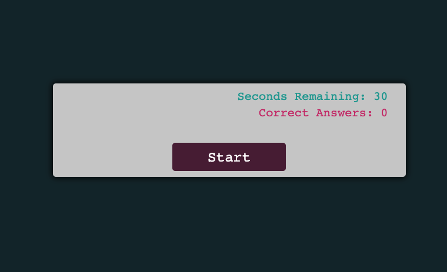
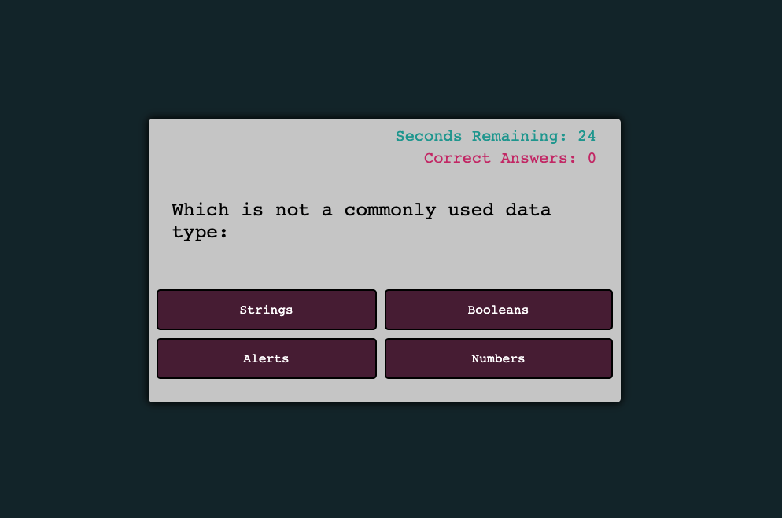
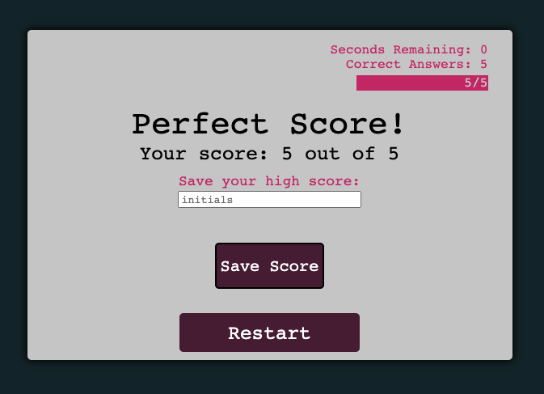
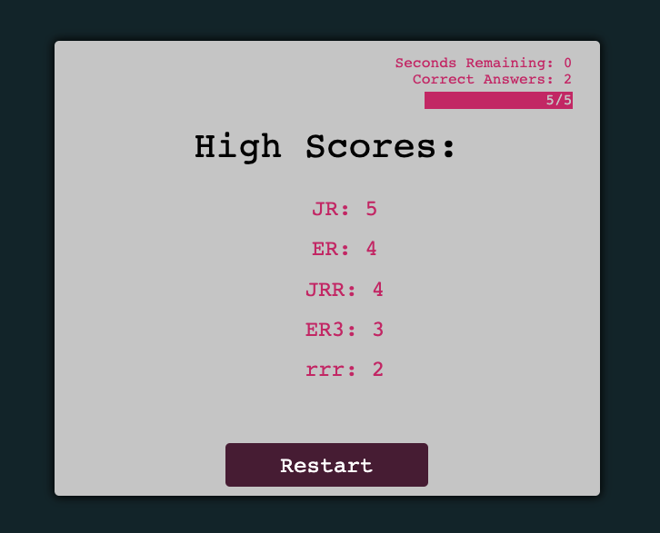

# Code-Quiz
A javascript powered quiz app.

## Rules
1. You have 30 seconds to answer 5 questions
2. When you get an answer wrong you lose 5 seconds from the timer
3. You can record your initials and high score at the end of the game

## Links to deployed application
GitHub Repository: https://github.com/jocelynrem/Code-Quiz

 Application: https://jocelynrem.github.io/Code-Quiz/

 ## What it looks like

 )
 )
 )
 )

